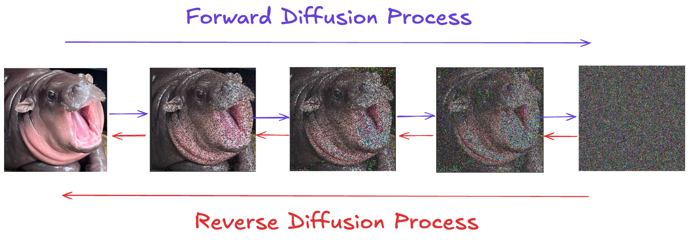
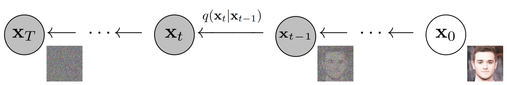
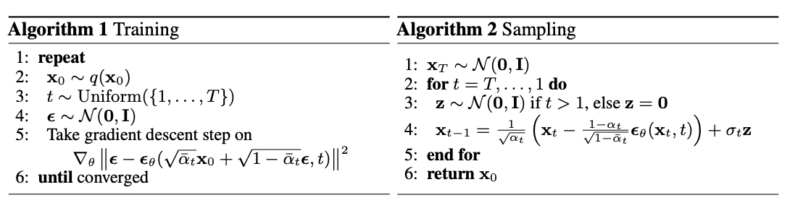
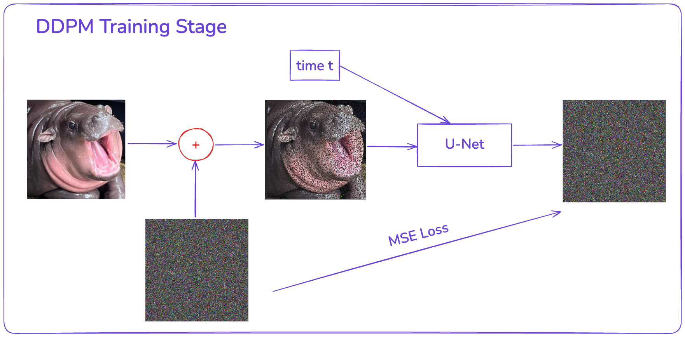
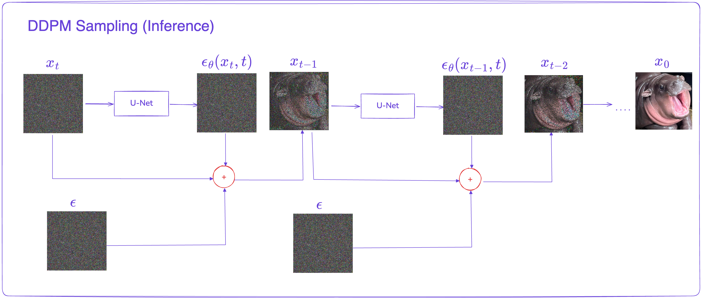

 

# Breaking Down Stable Diffusion (I) - Understanding DDPM

# Diffusion Probabilistic Models (DDPM)

https://arxiv.org/pdf/2006.11239

Before jumping into Stable Diffusion, it’s essential to understand Denoising Diffusion Probabilistic Models (DDPM), which lays the foundation for all image generation models in the future.

### What’s DDPM?

They are a class of **generative models** that work by iteratively **adding noise** to an input image and then learning to **denoise** from the noisy image to generate new samples.

DDPMs consist of two main processes:
- **Forward Diffusion Process**: Gradually corrupts data by adding noise over time.
- **Reverse Diffusion Process**: Learns to reverse the corruption and generate clean data from noise.

Let’s dig into a bit deeper on what these processes are doing.

## Forward Diffusion Process

### Key idea

In the forward process, we take an image $\mathbf{x}_0$ and add noise to it little by little. After $T$ steps, the final image $\mathbf{x}_T$ becomes almost pure Gaussian noise. This forward process is fixed and does not need training. It is a Markov chain, which means:

$$
q(\mathbf{x}_1, \dots, \mathbf{x}_T \mid \mathbf{x}_0) 
= \prod_{t=1}^T q(\mathbf{x}_t \mid \mathbf{x}_{t-1}).
$$

### How noise is added

We have this formula:

$$
\mathbf{x}_t 
= \sqrt{1 - \beta_t}\,\mathbf{x}_{t-1} \;+\; \sqrt{\beta_t} \,\boldsymbol{\epsilon},
\quad
\boldsymbol{\epsilon} \sim \mathcal{N}(0, 1).
$$

So at each time step, we add a bit of Gaussian noise:

$$
q(\mathbf{x}_t \mid \mathbf{x}_{t-1})
= \mathcal{N}\!\Bigl(\mathbf{x}_t 
\;\big|\; 
\sqrt{1-\beta_t}\,\mathbf{x}_{t-1}, 
\,\beta_t \mathbf{I}\Bigr).
$$

The state $\mathbf{x}_t$ depends only on $\mathbf{x}_{t-1}$ (Markov property). In the original DDPM work, the authors use a linear schedule for $\beta_t$. They pick values between 0.0001 and 0.02, and they set $T = 1000$.

### A very useful property

Given a time t, and initial image $ \mathbf{x}_0 $, the forward diffusion is a deterministic process. That means, you can directly sample $\mathbf{x}_t$ from $\mathbf{x}_0$ without simulating each intermediate step:

$$
q(\mathbf{x}_t \mid \mathbf{x}_0)
  = \mathcal{N}\!\Bigl(\mathbf{x}_t \;\big|\; \sqrt{\bar{\alpha}_t}\,\mathbf{x}_0, \,(1 - \bar{\alpha}_t)\mathbf{I}\Bigr),
$$

where

$$
\alpha_t = 1 - \beta_t, \quad
\bar{\alpha}_t = \prod_{\tau=1}^t \alpha_\tau.
$$

This is done by using a trick called **reparameterization**. We skip the detailed math here for simplicity.

## Reverse Diffusion Process

### Key idea

We want to go from noisy $\mathbf{x}_T$ back to a clean $\mathbf{x}_0$. Each small step removes a bit of noise (we call this denoising). If we have a sample $\mathbf{x}_T$, we want a chain of distributions

$$
p_\theta(\mathbf{x}_{t-1} \mid \mathbf{x}_t)
$$

that can undo the noise. We learn this distribution with a neural network, often a U-Net. We pick a random noise $\mathbf{x}_T$, then sample backward to $\mathbf{x}_0$. At each step, the model guesses how much of $\mathbf{x}_t$ is noise versus signal.

Because the forward process is Gaussian, the reverse process also has a Gaussian form. We train a noise predictor to approximate these reverse steps.

In other words, a DDPM is basically a noise-prediction model.

### Goal

We want a distribution 

$$
  p_\theta(\mathbf{x}_{t-1} \mid \mathbf{x}_t)
$$

for each time step $t$, that “reverses” the noising step. Starting from a random Gaussian $\mathbf{x}_T$, we sample from $p_\theta(\mathbf{x}_{T-1} \mid \mathbf{x}_T)$, then from $p_\theta(\mathbf{x}_{T-2} \mid \mathbf{x}_{T-1})$, and so on, all the way down to $\mathbf{x}_0$.  

### Learning the reverse step

Recall that the forward transition is:

$$
q(\mathbf{x}_t \mid \mathbf{x}_{t-1}) 
  = \mathcal{N}\!\bigl(
    \sqrt{1-\beta_t}\,\mathbf{x}_{t-1}, \;\beta_t \mathbf{I}
  \bigr).
$$

By properties of Gaussians, the reverse distribution given initial image $\mathbf{x}_0$ is also Gaussian :

$$
q(\mathbf{x}_{t-1} \mid \mathbf{x}_t, \mathbf{x}_0)
  = \mathcal{N}\!\Bigl(\mathbf{x}_{t-1}
    \;; \tilde{\boldsymbol{\mu}}(\mathbf{x}_0, \mathbf{x}_t),\;
    \tilde{\beta}_t \mathbf{I}\Bigr),
$$

where $\tilde{\boldsymbol{\mu}}(\mathbf{x}_0, \mathbf{x}_t)$ and $\tilde{\beta}_t$ are closed-form expressions derived from the forward process. Notice that we only have $\mathbf{x}_0$ at training time - our model has to learn to approximate this distribution *without* direct access to the ground-truth $\mathbf{x}_0$. (you can see why now at inference the model starts 'generating')

Thus, we *parameterize* the reverse process as:

$$
p_\theta(\mathbf{x}_{t-1} \mid \mathbf{x}_t)
  = \mathcal{N}\!\Bigl(
      \boldsymbol{\mathbf{x}_{t-1};\mu}_\theta(\mathbf{x}_t, t),\;\Sigma_\theta(\mathbf{x}_t, t)
    \Bigr)
$$

### Training objective

The training objective of diffusion-based generative models amounts to “maximizing the log-likelihood of the sample generated (at the end of the reverse process) (x) belonging to the original data distribution.”

In the DDPM paper, the authors use a variational lower bound (like in VAEs). It looks really complicated:

$$
\boxed{
L_{\mathrm{vlb}}(\theta)
= \underbrace{
  \mathbb{E}_{q}
  \bigl[
    -\log p_\theta(\mathbf{x}_0|\mathbf{x}_1)
  \bigr]
}_{L_0}
\;+\;
\sum_{t=2}^T 
\underbrace{
  \mathbb{E}_{q(\mathbf{x}_t|\mathbf{x}_0)}
  \bigl[
    D_{\mathrm{KL}}\bigl(
      q(\mathbf{x}_{t-1}\mid \mathbf{x}_t,\mathbf{x}_0)
      \,\|\, 
      p_\theta(\mathbf{x}_{t-1}\mid \mathbf{x}_t)
    \bigr)
  \bigr]
}_{L_{t-1}}
\;+\;
\underbrace{
  D_{\mathrm{KL}}\bigl(
    q(\mathbf{x}_T|\mathbf{x}_0)
    \,\|\, 
    p(\mathbf{x}_T)
  \bigr)
}_{L_T}.
}
$$

However, don't worry, here the author ignore two terms $L_0$ and $L_T$, only left $L_{T-1}$, where it is a KL divergence between two Gaussians (which has a closed-form expression in terms of their mean and variance)

After more math (not shown here), the training objective can be simplified to 
minimize 

$$
\left\| \boldsymbol{\epsilon} - \boldsymbol{\epsilon}_\theta(\mathbf{x}_t, t) \right\|^2
$$

where $\boldsymbol{\epsilon}_\theta(\mathbf{x}_t, t)$ is the model’s *prediction* of the noise. If the model perfectly predicts $\boldsymbol{\epsilon}$, it has effectively learned how to denoise $\mathbf{x}_t$ (i.e., to recover $\mathbf{x}_0$).

How elegant it is! This is the final loss function we use to train DDPMs, which is just a “Mean Squared Error” between the noise added in the forward process and the noise predicted by the model.

### Training and Sampling (inference) phase

With the training objective simplified, the training and sampling steps become more direct:

1. **Training**  
   - Take a real image $\mathbf{x}_0$.  
   - Pick a random time step $t$.  
   - Add noise to get $\mathbf{x}_t$.  
   - Let the model (U-Net) predict the noise in $\mathbf{x}_t$.  
   - Compute MSE between predicted noise and the actual noise.  
   - Backprop to update model weights.

2. **Sampling (Inference)**  
   - Start with random noise $\mathbf{x}_T$.  
   - Step backward using the learned reverse distribution.  
   - Each step removes a bit of noise.  
   - End with $\mathbf{x}_0$, which should look like a real image.

---

## Putting It All Together

1. **Forward diffusion**: We start with a clean image and add noise until it becomes pure noise. (No training in this step, it is fixed.)  
2. **Reverse diffusion**: We learn a denoising model that goes from noise back to a clean image.  
3. **Model structure**: Often a U-Net that takes a noisy image $\mathbf{x}_t$ and the time step $t$. It outputs the noise.  
4. **Sampling**: At test time, sample random noise from a Gaussian and apply the reverse process step by step to get a final image.

This is how DDPMs work! 
___

### Useful Links and References 

- **DDPM Paper**: [Denoising Diffusion Probabilistic Models (DDPM)](https://arxiv.org/pdf/2006.11239) 
- **Math Behind DDPM**: [Lilian Weng's Blog Post](https://lilianweng.github.io/posts/2021-07-11-diffusion-models/) 
- **DDPM Explained**: [YouTube Video](https://www.youtube.com/watch?v=1CIpzeNxIhU) 
