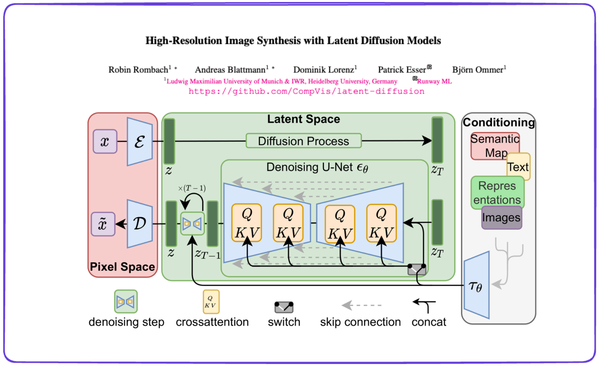
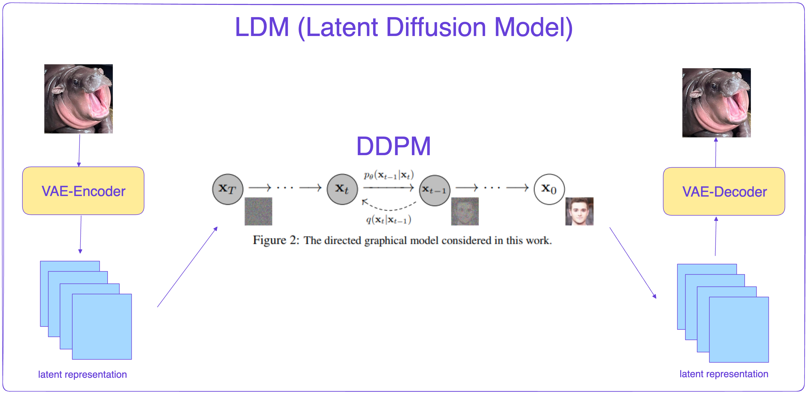
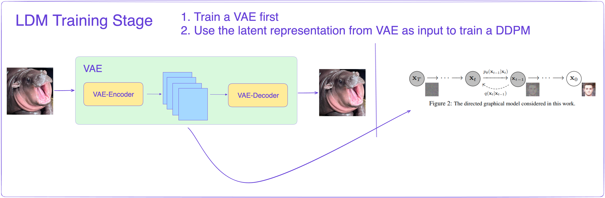
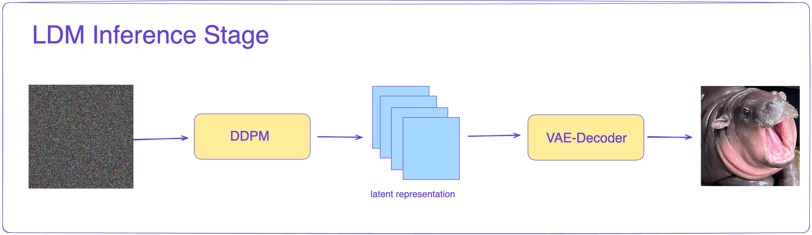
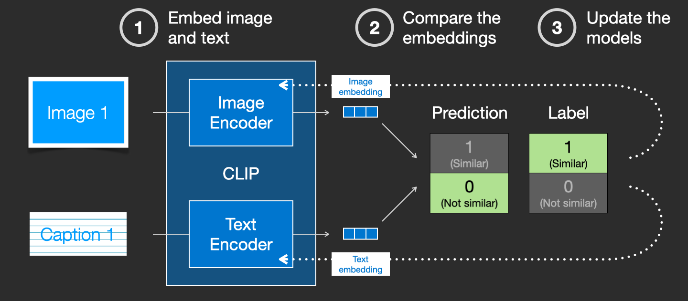
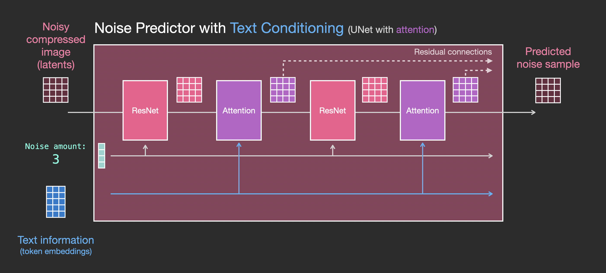

---
title: Breaking Down Stable Diffusion (II) - SD 1.0 Uncovered
draft: false
tags:
  - stable-diffusion
---
 

# Breaking Down Stable Diffusion (II) - SD 1.0 Uncovered

# Understanding Stable Diffusion and Latent Diffusion Models (LDM)

**Stable Diffusion** is a groundbreaking text-to-image generative model launched by Stability AI in 2022. It is built upon the concepts introduced in the paper  
[*High-Resolution Image Synthesis with Latent Diffusion Models* (Rombach et al.)](https://arxiv.org/abs/2112.10752).

Let's learn the key ideas behind **Latent Diffusion Models (LDMs)** and how they form the foundation of Stable Diffusion.

## 1. What Are Latent Diffusion Models?

A Latent Diffusion Model can be summarized by **three key points**:

1. **LDM = VAE + DDPM**  
2. **Diffusion happens in the latent space**  
3. **Conditioned Generation: Support for multimodal inputs** (e.g., text, categories, etc.)

Let's dig into the details now. 

## 2. Core Concepts of LDM

### 2.1 **LDM = VAE + DDPM**: The Model Structure

<small>*(Refer to the figure below.)*</small>

Latent Diffusion is essentially a **DDPM** (Denoising Diffusion Probabilistic Model) applied to features produced by a **VAE** (Variational Autoencoder).

- **What is a VAE (Variational Autoencoder)?**  
  A VAE is a type of neural network that compresses data into a smaller **latent representation** and then reconstructs it back to the original space. It consists of:
  1. **Encoder**: Compresses input data (e.g., an image) into a latent space.
  2. **Decoder**: Reconstructs data from the latent representation.

- **Why combine a VAE with DDPM?**  
  - Classic DDPMs perform diffusion in pixel space, which can be very **computationally expensive** for high-resolution images.  
  - By first encoding an image with the VAE, you effectively **downsample** the data into a latent space, making diffusion much more efficient.

---

### 2.2 **Diffusion in Latent Space**

Instead of denoising directly in pixel space, LDMs operate in a **smaller latent space**:

1. **Encode** the input image into a latent vector using the VAE encoder.  
2. **Diffusion process**: A DDPM progressively denoises this latent representation.  
3. **Decode** the final denoised latent back into image space via the VAE decoder.

#### Training and Inference Flows

**Training**  
   - Train a VAE to encode images into a latent space.  
   - Use the VAE’s encoder output (latent features) as input to the DDPM for diffusion.  

**Inference**  
 - Start from random noise in the latent space.  
 - Use the DDPM (in reverse) to gradually denoise the latent.  
 - Decode the final latent through the VAE decoder to generate the resulting image.

---

### 2.3 **Conditioned Generation: Incorporating Multimodal Inputs**

LDMs allow inputs such as **text prompts** (“a dog in a spaceship”), **class labels** (“cat,” “dog”), or even **segmentation maps**. This conditioning is made straightforward because the diffusion U-Net can receive these signals as extra inputs (e.g., through cross-attention or feature concatenation). 

This can be achieved using **Classifier-Free Guidance (CFG)**, a technique introduced in the paper *“Classifier-Free Diffusion Guidance”* by Ho & Salimans (2021).  
<https://arxiv.org/abs/2207.12598>

To fully grasp the idea, let's learn more about **CFG**

---

## 3. Classifier-Free Guidance (CFG)

When generating images with a condition (e.g., text prompt), **classifier-free guidance (CFG)** is a popular method to make the model’s outputs match the condition more closely. 

### 3.1 What Is Classifier-Free Guidance?

Traditionally, diffusion models could be guided by a **separate classifier** $p(y \mid x_t)$ to control sampling. However, **classifier-free guidance** lets you guide a diffusion model **without** training an extra classifier.

Instead, you train a **single** diffusion model in two modes:

1. **Conditioned mode**: Model sees the conditioning signal (e.g., text embedding $c$).  
2. **Unconditioned (null) mode**: Model sees no signal (or an empty prompt).

By mixing predictions from these two modes, you control how strongly the model focuses on the condition.

### 3.2 How Does It Actually Work?

Let $\boldsymbol{\epsilon}_\theta(x_t, c)$ be the model’s noise-prediction function (conditioned on $c$). Let $\boldsymbol{\epsilon}_\theta(x_t, \varnothing)$ be the noise prediction **without** any conditioning.

**Classifier-free guidance** blends these two predictions:
$$
\boldsymbol{\epsilon}_\theta^\text{(guided)}(x_t, c) 
\;=\; 
\boldsymbol{\epsilon}_\theta(x_t, \varnothing) 
\;+\; 
s \,\bigl[\boldsymbol{\epsilon}_\theta(x_t, c) \;-\; \boldsymbol{\epsilon}_\theta(x_t, \varnothing)\bigr],
$$
where:

- $x_t$ is the noisy sample at step $t$.  
- $c$ is the conditioning (text embedding, class label, etc.).  
- $\varnothing$ means **no condition** (null prompt).  
- $s$ is the **guidance scale** (often > 1).

During training, you **randomly drop out** the conditioning (e.g., 10% of the time). In inference, you:
1. Produce two noise predictions at each step: conditioned vs. unconditioned.  
2. Blend them with scale $s$.  
3. Update $x_t$ (or latent $\mathbf{z}_t$) using this guided noise estimate.

---

### 3.3 Why Use Classifier-Free Guidance?

- **No extra classifier**: The same diffusion model is used in conditioned and unconditioned modes.  
- **Easy control**: The guidance scale $s$ is a single parameter you can tweak.  
- **Simpler training**: One unified model with partial dropout of the condition.  
- **Flexible**: Works for text, class labels, style embeddings, or any other condition.

---

### 3.4 Training and Sampling Flow

1. **Training**: Randomly replace the condition $c$ with a null condition in some fraction of the data.  
2. **Sampling**: At each diffusion step, blend the unconditioned and conditioned noise predictions:
   $$
   \boldsymbol{\epsilon}_\theta^\text{(guided)}(x_t, c) 
   \;=\; 
   \boldsymbol{\epsilon}_\theta(x_t, \varnothing) 
   \;+\; 
   s \,\bigl[\boldsymbol{\epsilon}_\theta(x_t, c) - \boldsymbol{\epsilon}_\theta(x_t, \varnothing)\bigr].
   $$

This makes LDMs flexible for **multimodal** tasks while still controlling how strongly to follow the condition.

---

## 4. Controlling Generation with Text Inputs

To use text prompts (like “A cat in space”) as conditions, the text must be converted into a **numerical representation** (a text embedding) that the diffusion model can understand.

### 4.1 Text Encoder (CLIP)

**CLIP** (Contrastive Language–Image Pre-training) models are often used. A **text** transformer in CLIP converts the input prompt into an embedding. Because CLIP was trained on massive text–image pairs, it captures concepts that align well with images.

  
<small>*Image from [jalammar.github.io/illustrated-stable-diffusion/](https://jalammar.github.io/illustrated-stable-diffusion/)*</small>

- **Stable Diffusion v1** typically used the OpenAI-released **ClipText** model.  
- **Stable Diffusion v2** and later often use **OpenCLIP**, which can be much larger and more powerful.

### 4.2 Feeding Text Embeddings into the Diffusion Model

  
<small>*Image from [jalammar.github.io/illustrated-stable-diffusion/](https://jalammar.github.io/illustrated-stable-diffusion/)*</small>

The text embedding is injected into the U-Net via **cross-attention** mechanisms in each residual block. This architecture lets the diffusion process learn how to incorporate textual information at every step of image generation.

## 6. Stable Diffusion

Now that we’ve explored how Latent Diffusion Models (LDMs) work, we can look at **Stable Diffusion** as a direct application of these principles.

- **Training Data**: All versions of Stable Diffusion are trained on subsets of the **LAION** dataset (e.g., LAION-2B, LAION-aesthetics, LAION-5B).

### Model Evolution: V1.0 to V2.1
The overall architecture remains the same from v1.0 to v2.1, with just a few refinements. Here I’ve listed a summary of key changes for each **Stable Diffusion** version.

| **SD Version** | **Time**   | **Description**                                                                                                                                                                                                                          |
|----------------|-----------|-------------------------------------------------------------------------------------------------------------------------------------------------------------------------------------------------------------------------------------------|
| **SD1.1**      | 2022.8    | - 237k steps at 256×256 resolution on LAION‑2B‑en - 194k steps at 512×512 on a high‑resolution subset of LAION (≥ 1024×1024).                                                                                                           |
| **SD1.2**      | 2022.8    | - Continued from SD1.1 checkpoint - 515k steps at 512×512 on LAION‑aesthetics v2 5+                                                                                                                                                     |
| **SD1.3**      | 2022.8    | - Continued from SD1.2 - 195k steps at 512×512 on LAION‑aesthetics v2 5+ - 10% text‑conditioning dropout to enhance CFG sampling                                                                                                      |
| **SD1.4**      | 2022.8    | - Similar to SD1.3 but with 225k steps at 512×512 on LAION‑aesthetics v2 5+ - 10% text‑conditioning dropout                                                                                                                               |
| **SD1.5**      | 2022.10   | - Continued from SD1.2 - 595k steps at 512×512 on LAION‑aesthetics v2 5+ - 10% text‑conditioning dropout                                                                                                                               |
| **SD2.0**      | 2022.11   | - Trained **from scratch**, not continued from 1.x - Uses **OpenCLIP‑ViT/H** as the text encoder - Default image size up to **768×768**                                                                                               |
| **SD2.1**      | 2022.12   | - Fine‑tuned version of 2.0 - Models available at 768×768 (2.1‑v) and 512×512 (2.1‑base) - Trained on a less restrictive NSFW filter for LAION‑5B                                                                                      |

- **From SD 1.0 to 1.5**:  
  These releases primarily continue training from existing checkpoints, gradually refining the model on aesthetic-filtered subsets of LAION.

- **Transition to SD 2.0+**:  
  - **New Text Encoder**: Uses **OpenCLIP-ViT/H**, allowing for more expressive text embeddings.  
  - **Higher Resolution**: Default output resolution increased up to **768×768** pixels for enhanced detail.  
  - **From Scratch**: SD 2.x models are trained starting from scratch, rather than continuing from the 1.x checkpoints.

That's all you need to know for Stable diffusion! 

___

### Useful Links and References 

**Latent Diffusion Model Paper**: [Latent Diffusion Models](https://arxiv.org/pdf/2112.10752.pdf)
**VAE Explanation**: [Towards Data Science Guide](https://towardsdatascience.com/vae-variational-autoencoders-how-to-employ-neural-networks-to-generate-new-images-bdeb216ed2c0) 
**CLIP Model**: [GitHub Repository](https://github.com/openai/CLIP) 
**OpenCLIP**: [GitHub Repository](https://github.com/mlfoundations/open_clip) 
**Stable Diffusion Explained**:
- [Illustrated Guide](https://jalammar.github.io/illustrated-stable-diffusion/) 
- [Medium Article](https://medium.com/@steinsfu/stable-diffusion-clearly-explained-ed008044e07e) 

