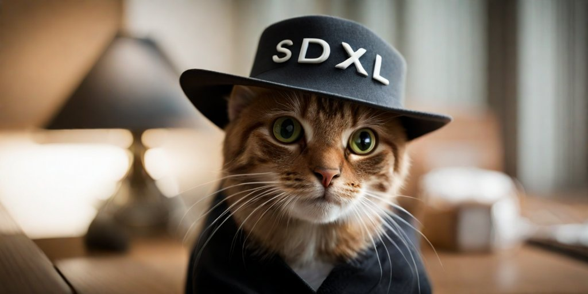
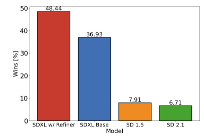
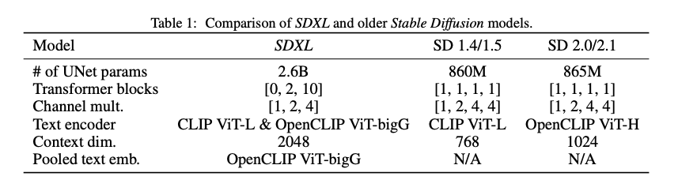
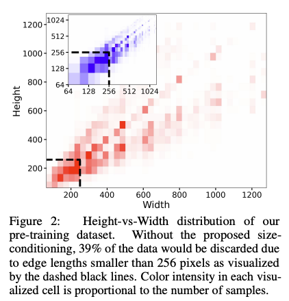
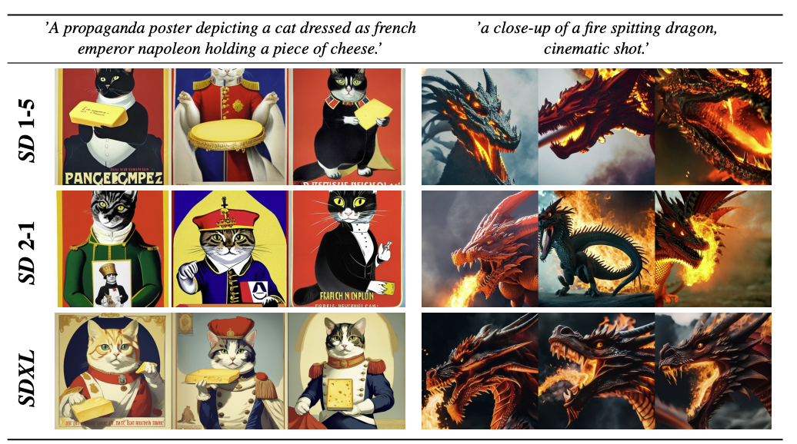
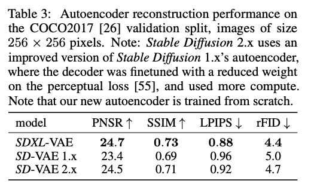
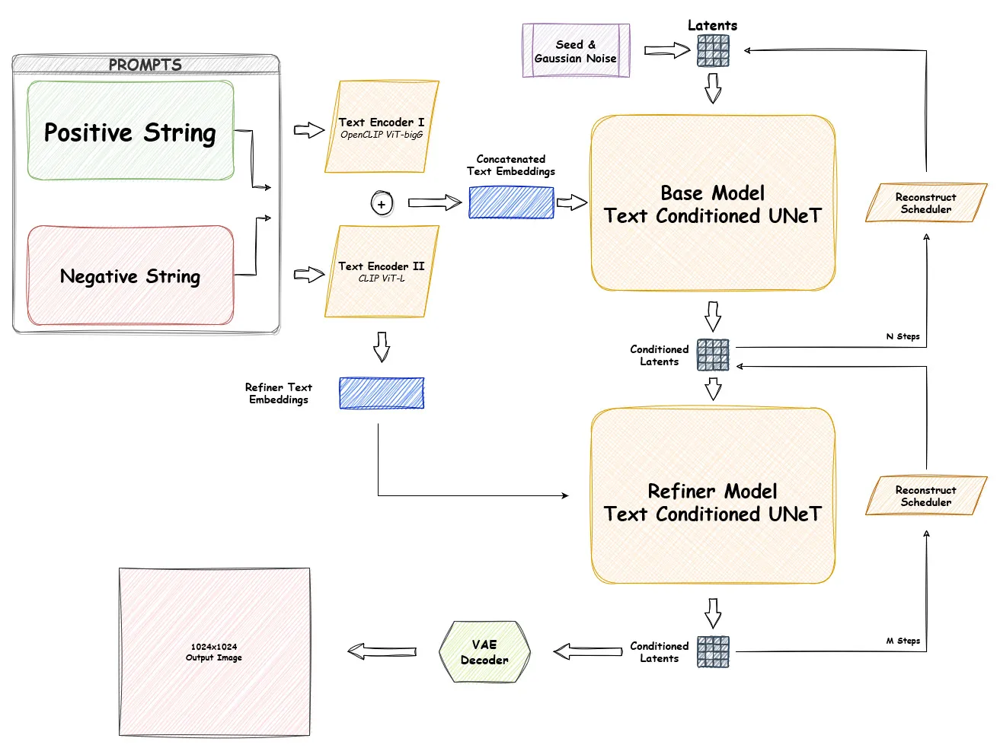

---
title: Breaking Down Stable Diffusion (III) - From SD 1.0 to SDXL
draft: false
tags:
  - stable-diffusion
---

# Breaking Down Stable Diffusion (III) - From SD 1.0 to SDXL

In the previous chapter, we learned the basics of LDM and how SD works. In this chapter, we’ll explore another exciting upgrade: from SD 1.0 to SDXL. **Stable Diffusion XL (SDXL)** is a significant step forward from earlier Stable Diffusion models (e.g., SD 1.5). Two main papers discuss this new iteration:

1. **SDXL**  
   <https://arxiv.org/pdf/2307.01952>  
2. **Adversarial Diffusion Distillation (SDXL‑Turbo)**  
   <https://arxiv.org/pdf/2311.17042>

Below, we’ll focus on the core SDXL paper and highlight the key ideas that make it stand out among text-to-image models.

## How Good Is It?
  
*Image from the SDXL paper*

First, let’s look at its performance improvement. As shown in the figure, the SDXL paper reports experimental results demonstrating that SDXL *significantly* outperforms SD 1.5 and SD 2.1.

Now let’s dig into SDXL and see what drives this level of improvement.

---

## What Is SDXL?

Compared to SD 1.5, **SDXL** introduces:

- A **larger model** 
- **Additional conditioning signals** 
- A **stronger VAE** 
- A **two-model system** 

---
## Larger Model
  
*Image from the SDXL paper*

A major difference between SDXL and older versions is the substantially increased size and complexity of both the U-Net and text-encoder components:

1. **U-Net Parameter Growth**  
   - From ~0.8 B parameters (SD 1.5)  
   - To ~2.6 B parameters (SDXL)

2. **Dual Text Encoders**  
   - **CLIP ViT‑L**  
   - **OpenCLIP ViT‑bigG**  
   - Text from both encoders is concatenated along the **channel axis** and fed into the U-Net.

3. **Increased Context Dimension**  
   - From 768 → 2048  
   - This allows for more expressive text embeddings and better prompt interpretation.

4. **Pooled Text Embedding**  
   - Uses **OpenCLIP ViT‑bigG** to provide an additional global text embedding (i.e., a pooled embedding vector).

---

## More Conditions

In the SDXL paper, the authors introduce *micro-conditioning*—extra conditions that improve the model’s versatility and handling of diverse image resolutions or crops. These include:

### Conditioning on **Original Image Size**

- **Why?**  
  During training, many images in LAION (or similar datasets) are smaller than 256×256, so they might get discarded or scaled in a way that loses detail.  
- **How?**  
  The model receives two parameters, e.g., **(height_original, width_original)**, indicating the image’s **original** resolution. This helps the model better learn from varied image sizes.

### Conditioning on **Cropping Parameters**

- **Why?**  
  Random cropping can lead to incomplete or “cut-off” images, degrading training.  
- **How?**  
  The model gets extra parameters, e.g., \((c_\text{top}, c_\text{left})\), describing how the training crop was taken. (At inference, this defaults to \((0,0)\) if no crop is used.)

### Conditioning on **Target Resolution** (Multi-aspect training)

- **Why?**  
  Training on a single resolution (e.g., 256×256) makes it hard to generate good images at *different* resolutions.  
- **How?**  
  1. **Bucket** images of various resolutions into different groups.  
  2. Sample batches from these “resolution buckets” during training.  
  3. Pass the “target resolution,” i.e., **(height_target, width_target)**, as a condition to the model.

This way, the network becomes adept at generating images across multiple aspect ratios and resolutions.

#### Incorporating Micro-Conditioning Into the Model

A simple approach is to merge these extra signals (original size, crop parameters, target resolution, etc.) into one embedding vector, then concatenate it along the channel axis with other embeddings. Everything is then passed through an MLP before being injected into the U-Net.

---

## Better VAE

Compared to previous versions, SDXL features an improved **Variational Autoencoder** that achieves higher reconstruction quality. In practice, this means:

- **Sharper details** when converting from latent to pixel space.  
- **Less artifacting** and better color consistency.

The improved VAE is trained on a large, diverse set of images to handle a wide range of styles and resolutions.

---

## Two-Model System: Base + Refiner
  
<small>Image source: [Towards Data Science](https://towardsdatascience.com/the-arrival-of-sdxl-1-0-4e739d5cc6c7)</small>

### Why Two Models?

The authors found that while the **Base** model excels at capturing broad composition, it sometimes misses finer details. To address this, they introduce a **Refiner** model—a second stage that takes the Base model’s output and enhances it by:

- **Adding details**  
- **Improving color fidelity**  
- **Aligning more closely** with the prompt

### How Does It Work?

The Refiner is essentially another LDM (with its own U-Net, text-encoder inputs, etc.). It starts with the latent output of the Base model and performs an additional diffusion process—often with fewer steps—to polish the image. 

---

### Useful Links and References 

- **SDXL Paper**: [SDXL: Improving Latent Diffusion Models for High-Resolution Image Synthesis](https://arxiv.org/pdf/2307.01952) 
- **SDXL-Turbo Paper**: [Adversarial Diffusion Distillation](https://arxiv.org/pdf/2311.17042)

